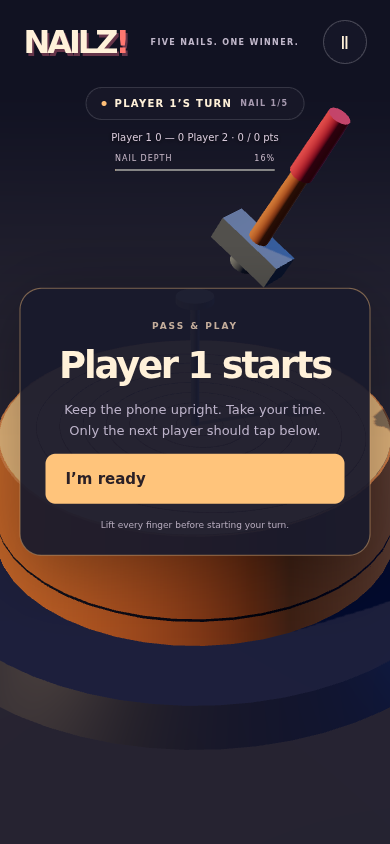
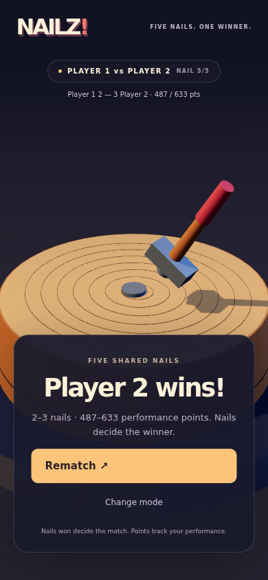

# E3 validation — 2026-10-04

- TypeScript check and production build: passed; existing 500KB chunk warning remains (558.08KB JS / 141.68KB gzip).
- 31 unit tests: passed, including four complete solo difficulty matches, five-nail local orchestration, three-win early-clinch continuation, points-versus-nails priority, starter alternation/rematch swap, and the E1/E2 physics/input regressions.
- Solo browser regression: passed, no page errors. Pointer-controlled perfect finish, touchscreen taps, focus timeout, pause, cancellation, weak strike, operator alternation, and landscape pause.
- Local browser integration: passed, no page errors. Two complete five-nail matches, actual touch aim taps and pointer swipes, blocked readiness while another finger remains, cancelled readiness, pause/resume, background event, portrait/landscape transitions, same-person next-nail readiness, safe ready-tap consumption, rematch starter swap, and switching back to solo at results.
- Balance: 20,000 input samples plus 2,000 five-nail simulations per preset; reproducible seed and full results in `balance.json`.
- `git diff --check`: passed.

These screenshots use a controlled browser clock and software-rendered Chromium. Background handling uses a dispatched visibility event; rotation uses a changed viewport. Neither is a claim of physical mobile-OS testing. Human two-person phone passing, Safari/Android hardware, perceived fun, thermal behavior, and sustained frame rate remain pending. Art is the temporary E1/E2 geometry, with final environment work scheduled for E4.

## Production E2E follow-up

`npm run test:e2e` passed after building and serving the production bundle with Vite preview. Six scenarios completed: solo controls, two local matches/rematch/mode switching, and a complete five-nail match for each of Easy, Normal, Hard, and Champion. No runtime, console, failed-request, or HTTP errors were reported. All 31 unit tests still pass. See `production-e2e.json` for the execution record and environment limits. The GitHub Actions workflow is configured; this local report does not claim a hosted CI result.
